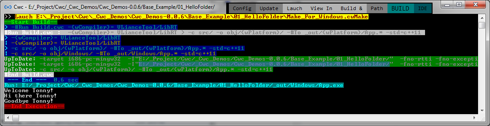

# The CWeet Compilation "  "

Cwc is a **front-end** C++ compiler made for programmers who want to make their life easier.

It use a **straightforward language -> command line injection**

It can be used as a direct replacement for GCC or Clang.

Say goodbye to the huge mess of C++ compilation. This tool will become your best friend !

It can be seen as a smart compiler, easy to use with many additions. It can be connected to any IDE and enjoy of all its features.

Cwc, is not a compiler in itself, like a chameleon, it redirects inputs / outputs with any back-end compiler.

## Command line:

The main principle is to send several commands simultaneously, with the following separators:

`|` : Allows you to send commands simultaneously in multi-process. The output is guaranteed to be in the same order,
so it's always the same result that is displayed

`>`: To make sequences, when it's necessary to wait for previous orders

So we can do something like **"buildObj `|` buildObj `>` Link"**

Example: **"-c Src1.cpp -o Src1.o `|` -c Src2.cpp -o Src2.o `>` -o App.exe Src1.o Src2.o"**

## Main Feature

### Modular
All backend compiler or lib that is required for a project will be automatically downloaded and will have its own
compilation toolchain and arguments

### Speed + Dependency walker
To speed up the compilation it is important not to recompile the already created object files.
Many IDEs are unable to correctly detect changes (which file depends on which) and often result in an erroneous executable, some of which has not
been up to date, causing serious errors that are difficult to pinpoint.

Cwc has a concrete detection, it checks all the dependencies of each file, it also checks for file change as well as
any change of command line. A command like "clean" is thus practically obsolete.

### Compilation by folder:
It is possible to send a whole directory in one command line. It will process all the files inside, which greatly simplify the command list.

### Accepts the variables:
We can insert variables in our commands, using braces {}
There are a lot of build-in vars to simplify compilation processs like the build type (x86, x64, Debug, O2, O3) which requires different folder.

### Sanitizer:
Connect to DrMemory, you can comb through all possible memory errors.

### Debugger
Cwc use the universal [DBGP common Debugger prorotocol](https://xdebug.org/docs-dbgp.php).

So you can debug in your prefered IDE, see the notepad++ plugin: [DBGpPluginMx](https://github.com/VLiance/DBGpPluginMx)

# Screen

 
 
 
 # Supported Export Platform

Cwc can export binary files to any platform without any modification of your makefile or your code

Currently, these "out of the box" [toolchains](https://github.com/VLianceTool) are available:

Toolchain  | From  | Target
 --- | --- | ---
[LibRT](https://github.com/VLianceTool/LibRT) | Windows | Windows, Linux
[WebRT](https://github.com/VLianceTool/WebRT) | Windows | Web (Wasm/JS)
[DJGPP_RT](https://github.com/VLianceTool/DJGPP_RT) | Windows | DOS / OSdev
[Elf_RT](https://github.com/VLianceTool/Elf_RT) | Windows | Linux / OSdev

Any other [custom toolchain](https://github.com/VLiance/Cwc/wiki/Build-your-own-Toolchain) can be added easily with a Github repo, possibilities are limitless.

 # How to use

See the [wiki](https://github.com/VLiance/Cwc/wiki):
* [Directives](https://github.com/VLiance/Cwc/wiki/Directives)
* [Variable](https://github.com/VLiance/Cwc/wiki/Variables)

See some examples:
* [Libs using Cwc](https://github.com/cwc-lib)
* [Games builded with Cwc](https://github.com/Cwc-game)
